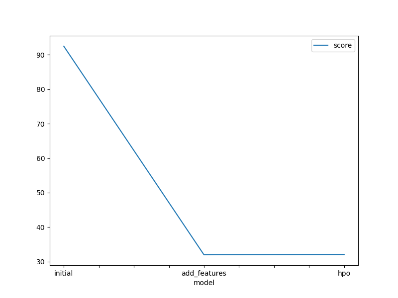

# Report: Predict Bike Sharing Demand with AutoGluon Solution
#### Pham Van Manh (ManhPV8)

## Initial Training
### What did you realize when you tried to submit your predictions? What changes were needed to the output of the predictor to submit your results?
-  My score not better after each try submit:)))
-  With negative value i must change to 0.
### What was the top ranked model that performed?
- Embedding_Ensamble_L2

## Exploratory data analysis and feature creation
### What did the exploratory analysis find and how did you add additional features?
- I have found time can effective to demand. So I was parsing datetime column to features: day, month, dayofweek, weakofyear.
- The temp effect to demand, but we should define level temp (category temp), so i was classify temp to 4 level. 
### How much better did your model preform after adding additional features and why do you think that is?
- After adding additional features, the score from  1.8 -> 0.50. Because, the first, the datetime column (not parsing) is string column, is unique value and not good when present as a feature. The second, when temp column can't present difference between level very cold, cold, hot, very hot.

## Hyper parameter tuning
### How much better did your model preform after trying different hyper parameters?
- It not good:))))

### If you were given more time with this dataset, where do you think you would spend more time?
- I will spend more time for Feature engineering
### Create a table with the models you ran, the hyperparameters modified, and the kaggle score.
|model|hpo1|hpo2|hpo3|score|
|--|--|--|--|--|
|initial|None|None|None|1.86430|
|add_features|None|None|None|0.51737|
|hpo||?|?|?|

### Create a line plot showing the top model score for the three (or more) training runs during the project.

TODO: Replace the image below with your own.

### Create a line plot showing the top kaggle score for the three (or more) prediction submissions during the project.

TODO: Replace the image below with your own.

## Summary
- EDA data for analyst and find new features.
- Analyst and remove feature relation each other (reduce resource compute)
- Use Autogluon for fineturning multi-model with hyperparamters.
